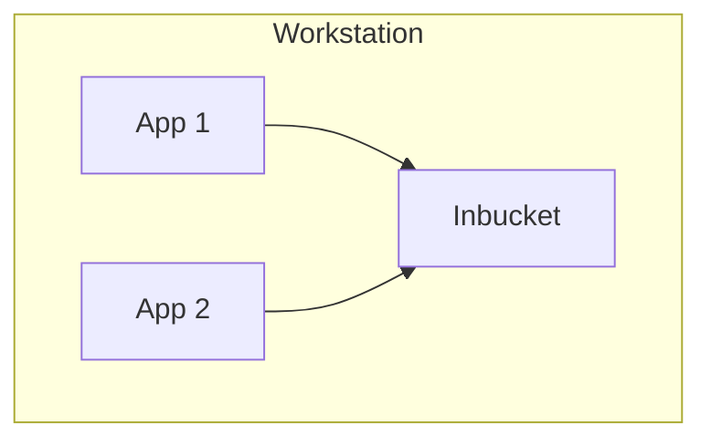

# Intended Usage

Inbucket can be used in many different scenarios.  It was designed to be used
during software development and testing, and is not intended for storing mail
of any significance.

## Local Development

Inbucket can be run without installing, after extracting the release for your
platform, start in a terminal inside the directory containing the extracted
files and run `./inbucket` or `inbucket.exe`.  This will launch an server
listening for SMTP messages on port 2500, and the web interface will be served
on port 9000.

## Docker Compose

## Companion Mail Server
